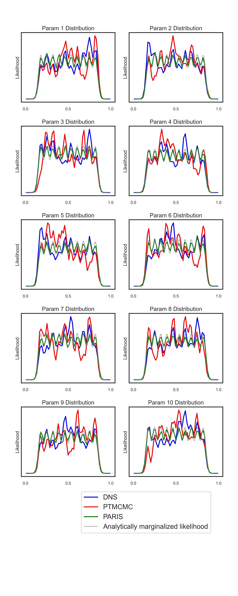

# PARIS Monte Carlo Sampler

**An efficient adaptive importance sampler for high-dimensional multi-modal Bayesian inference.**

PARIS (**Parallel Adaptive Reweighting Importance Sampling**) combines global exploration with local adaptation to tackle complex posteriors. The workflow is simple:

1. **Global Initialization**: Start with a space-filling design (e.g. Latin Hypercube Sampling) to seed promising regions.
2. **Adaptive Proposals**: Each seed runs its own importance sampling process, where the proposal is a Gaussian mixture centered on past weighted samples with covariance estimated from the local sample set.
3. **Dynamic Reweighting**: All samples are reweighted against the evolving proposal mixture, ensuring unbiased estimates and self-correcting any early overweights.
4. **Mode Clustering**: Parallel processes that converge to the same region are merged to avoid redundancy, while distinct modes are preserved.
5. **Posterior & Evidence**: The collected weighted samples directly reconstruct the posterior and yield accurate Bayesian evidence estimates.

This adaptive–parallel design allows PARIS to efficiently discover, refine, and integrate over complex multi-modal landscapes with minimal tuning and far fewer likelihood calls than conventional approaches.

## Documentation

📖 **[Visit the official documentation site](https://mx-liu123.github.io/parismc/)** for detailed usage guides, API reference, and examples.

## How it Works

PARIS combines the exploratory power of global sampling with the precision of local adaptation.

1.  **Global Exploration**: The sampler begins with **Latin Hypercube Sampling (LHS)** to uniformly cover the prior and identify promising regions.
2.  **Local Adaptation**: Multiple parallel "seeds" explore these regions independently. Each seed builds a **local Gaussian Mixture** proposal that adapts to its own sample history, automatically focusing on high-density modes.
3.  **Parallel Merging**: As parallel processes evolve, they monitor each other. If two seeds converge toward the same mode, they **automatically merge** to eliminate redundancy and save computational resources.
4.  **Efficient Reweighting**: A **sliding window** mechanism ensures that importance weights remain accurate even in high dimensions, keeping the computational cost per iteration constant regardless of the total sample size.

*For the rigorous mathematical derivation and implementation details, please refer to the [User Guide](https://mx-liu123.github.io/parismc/user/guide.html) and our paper.*

## Performance

### 10D Gaussian Mixture Model Benchmark

PARIS demonstrates exceptional efficiency in high-dimensional, multi-modal scenarios. In a challenging 10D GMM with 10 equally weighted modes:

| Method | Sample Number | Total Calls | Log Evidence |
|--------|---------------|-------------|--------------|
| **PARIS** | 145,420 | **150,050** | **2.30** |
| Dynesty | 145,423 | 8,587,847 | 2.30 |
| PTMCMC | 145,400 | 822,352 | 1.91 |

**Key Results:**
*   **57× fewer likelihood evaluations** than Dynesty (Dynamic Nested Sampling)
*   **5.5× fewer likelihood evaluations** than PTMCMC
*   **Accurate evidence estimation** (2.30 vs theoretical 2.30)
*   **Consistent mode recovery** across all dimensions
*   **Robust performance** with N_LHS=10⁴, N_seed=100

<div align="center">

</div>

*Figure: 1D marginalized posterior comparison. PARIS (green) closely matches the analytical target distribution (grey), while competitors show mode recovery bias. The target distribution's uniform-like appearance in 1D projections results from LHS-based placement of GMM component centers ensuring maximal separation. PARIS achieves this accuracy with dramatically fewer likelihood evaluations.*

## Features

* **Adaptive Proposals per Seed** – Each process maintains its own proposal, evolving a local Gaussian mixture that adapts to past samples.
* **Auto-balanced Exploration** – High-weight discoveries automatically attract more samples, while overweights self-correct over time.
* **Accurate Evidence Estimation** – Bayesian evidence is computed directly from importance weights, no extra machinery needed.
* **Parallel Mode Discovery** – Multiple seeds explore independently, merging only when they converge to the same mode.
* **Intuitive Hyperparameters** – Settings like number of seeds, initial covariance, and merge thresholds map directly to prior knowledge.
* **Efficiency at Scale** – Handles high-dimensional, multi-modal targets with substantially fewer likelihood calls.
* **Boundary-safe** – Automatically respects [0,1]^d priors.
* **Multiprocessing Ready** – Runs smoothly across CPU cores for large inference tasks.
* **Reproducibility** – Fully deterministic execution when a ``seed`` is provided, ensuring consistent results across runs.
* **Flexible Initialization** – Support for user-provided starting points (e.g. from Sobol sequences or specific physical locations) via the External LHS interface.

## Installation

### From PyPI (when available)
```bash
pip install parismc
```

### From Source
```bash
git clone https://github.com/mx-Liu123/parismc.git
cd parismc
pip install -e .
```

### Development Installation
```bash
git clone https://github.com/mx-Liu123/parismc.git
cd parismc
pip install -e .[dev]
```

## Quick Start

```python
import numpy as np
from parismc import Sampler, SamplerConfig

# Define your log-likelihood function (batched)
def log_likelihood(x):
    """Batched log-density: x has shape (n, ndim) and returns (n,).

    For a single point, pass x as x[None, :] (shape (1, ndim)).
    """
    return -0.5 * np.sum(x**2, axis=1)

# Create sampler configuration
config = SamplerConfig(
    alpha=1000,
    boundary_limiting=True,
    use_pool=False  # Set to True for multiprocessing
)

# Initialize sampler
ndim = 2
n_seed = 5
init_cov_list = [np.eye(ndim) * 0.1] * n_seed

sampler = Sampler(
    ndim=ndim,
    n_seed=n_seed,
    log_density_func=log_likelihood,
    init_cov_list=init_cov_list,
    config=config
)

# Prepare initial samples
sampler.prepare_lhs_samples(lhs_num=1000, batch_size=100)

# Run sampling
sampler.run_sampling(num_iterations=500, savepath='./results', stop_dlogZ=0.1)

# Optional: tune the evidence stability threshold (default None disables)
# sampler.run_sampling(num_iterations=500, savepath='./results', stop_dlogZ=0.1)

# Get results
samples, weights = sampler.get_samples_with_weights(flatten=True)
```

**Log-Density Function Interface**

- Input `x`: numpy array of shape `(n, ndim)`; return a 1D array of length `n` with log densities.
- Single point: pass as `x[np.newaxis, :]` so shape is `(1, ndim)`.
- Multiprocessing (`use_pool=True`): PARIS parallelizes evaluations across rows; write your function in a vectorized way over rows.
- Convenience pattern to support both batched and accidental single-point calls:
  ```python
  def log_density(x):
      x = np.atleast_2d(x)
      return -0.5 * np.sum(x**2, axis=1)
  ```

## Advanced Usage

### Custom Prior Transform

PARIS works internally in the $[0, 1]^d$ unit hypercube. If your parameters have physical bounds (e.g., mass, distance), use a `prior_transform` function to map the unit cube to your physical space.

**Note**: Your `log_density` function will receive the **transformed (physical)** parameters.

```python
from scipy.stats import norm

def prior_transform(u):
    """Map unit cube [0, 1] to physical space."""
    x = np.copy(u)
    # Param 0: Uniform [-5, 5]
    x[:, 0] = u[:, 0] * 10 - 5
    # Param 1: Normal(0, 1)
    x[:, 1] = norm.ppf(u[:, 1])
    return x

sampler = Sampler(
    ...,
    prior_transform=prior_transform
)
```

### Multiprocessing Caveats

- Windows/macOS and notebooks use the "spawn" start method. Always guard code with `if __name__ == "__main__":` when `use_pool=True`.
- Define `log_density` and `prior_transform` at module top level. Avoid lambdas, inner functions, or closures; they are not pickleable for `multiprocessing.Pool`.
- Notebooks: prefer `use_pool=False`. For parallel runs, move code into a `.py` script and run from the terminal.
- Typical safe pattern:
  ```python
  # my_script.py
  import numpy as np
  from parismc import Sampler, SamplerConfig

  def log_density(x):
      x = np.atleast_2d(x)
      return -0.5 * np.sum(x**2, axis=1)

  def main():
      ndim = 2; n_seed = 5
      cfg = SamplerConfig(use_pool=True, n_pool=4)
      sampler = Sampler(ndim, n_seed, log_density, [np.eye(ndim)*0.1]*n_seed, config=cfg)
      sampler.prepare_lhs_samples(lhs_num=1000, batch_size=100)
      sampler.run_sampling(num_iterations=500, savepath='./results', stop_dlogZ=0.1)

  if __name__ == "__main__":
      import multiprocessing as mp
      mp.freeze_support()               # Windows executables; harmless elsewhere
      mp.set_start_method("spawn", force=True)  # Explicit, portable start method
      main()
  ```
- Troubleshooting potential hangs:
  - Script never starts or stalls at pool creation → add the main-guard and `set_start_method("spawn")` as above.
  - Workers crash immediately → ensure `log_density` is top-level and returns `np.ndarray` of shape `(n,)`.
  - Notebook hangs → disable multiprocessing (`use_pool=False`) or run as a script.
  - Reduce `n_pool` to 1 to isolate pickling issues; then increase.

### Runtime flag controls

- `sampler_flags.json` is created/reset in the working directory when `run_sampling` starts.
- Toggle a flag to `true` while the sampler is running; it will execute the action once and reset the flag to `false`.
- Available flags:
  - `output_latest_samples`: write `latest_samples.npy` and `latest_weights.npy` (transformed space, flattened).
  - `plot_latest_samples`: write `latest_corner.png` (requires `corner` and `matplotlib`).
  - `print_latest_infos`: write `latest_infos.txt` with per-process diagnostics (weighted mean, covariance, max log-density/weights).
- Quick toggle example from Python:
  ```python
  import json
  with open("sampler_flags.json", "r", encoding="utf-8") as f:
      flags = json.load(f)
  flags["output_latest_samples"] = True
  with open("sampler_flags.json", "w", encoding="utf-8") as f:
      json.dump(flags, f)
  ```

### Custom Prior Transform

```python
def uniform_to_normal(x):
    """Transform from [0,1]^d to unbounded space"""
    from scipy.stats import norm
    return norm.ppf(x)

sampler = Sampler(
    ndim=ndim,
    n_seed=n_seed,
    log_density_func=log_likelihood,
    init_cov_list=init_cov_list,
    prior_transform=uniform_to_normal
)
```

### Configuration Options

```python
config = SamplerConfig(
    seed=42,                    # Set seed for reproducible results (default: None)
    merge_confidence=0.9,       # Coverage prob mapped to Mahalanobis merge radius R_m (0→R_m=0, 1→R_m→∞)
    alpha=1000,                 # Number of most recent samples used for weighting
    trail_size=1000,            # Maximum trial samples per iteration
    boundary_limiting=True,     # Enable boundary constraint handling
    use_beta=True,              # Use beta correction for boundaries
    integral_num=100000,        # Monte Carlo samples for beta estimation
        gamma=100,                  # Covariance update frequency
        use_pool=True,              # Enable multiprocessing
        n_pool=4,                   # Number of processes
        merge_type='single',        # Merging strategy: 'distance', 'single' (default), or 'multiple'
        debug=False                 # Enable debug logging
    )
    ```

### Key Hyperparameters

*   **n_lhs**: Number of initial search points. Use higher values for high-dimensional spaces or very narrow modes.
*   **n_seed**: Number of initial parallel processes. Typically set to a few times the expected number of modes.
*   **alpha**: Size of the sliding window for weighting. Controls local resolution and how much past information is retained.

*For a full list of configuration options and tuning tips, please refer to the [User Guide](https://mx-liu123.github.io/parismc/user/guide.html).*

## API Reference

### Main Classes

- `Sampler`: Main sampling class
- `SamplerConfig`: Configuration dataclass

### Key Methods

- `prepare_lhs_samples()`: Initialize with Latin Hypercube Sampling
- `run_sampling(num_iterations, savepath, print_iter=1, stop_dlogZ=None)`: Execute the sampling process; if `stop_dlogZ` is set, stop when `|logZ(i) - logZ(i-alpha)| <= stop_dlogZ` (checked every `alpha` iterations)
- `get_samples_with_weights()`: Retrieve samples and importance weights
- `save_state()` / `load_state()`: State persistence

#### Loading a Saved Sampler

```python
from parismc import Sampler

# Load sampler state (e.g., from the multimodal example output)
sampler = Sampler.load_state('./multimodal_results/sampler_state.pkl')

# Access weighted samples
samples, weights = sampler.get_samples_with_weights(flatten=True)
```

See `examples/load_sampler_example.py` for a complete, multi-modal loading + analysis walkthrough.

### Utility Functions

- `find_sigma_level()`: Compute confidence level thresholds
- `oracle_approximating_shrinkage()`: Covariance regularization
- Various weighting and clustering utilities

## Requirements

- Python >= 3.8
- NumPy >= 1.20.0
- SciPy >= 1.7.0
- scikit-learn >= 1.0.0
- smt >= 2.0.0
- tqdm >= 4.62.0

## License

MIT License - see LICENSE file for details.

## Contributing

Contributions are welcome! Please feel free to submit pull requests or open issues.

## Citation

If you use this software in your research, please cite:

```bibtex
@software{parismc,
  title={Parallel Adaptive Reweighting Importance Sampling (PARIS)},
  author={Miaoxin Liu, Alvin J. K. Chua},
  year={2025},
  url={https://github.com/mx-Liu123/parismc}
}

```


