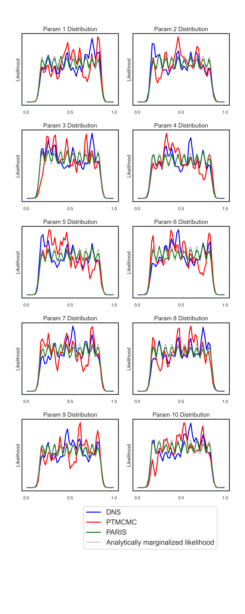

# PARIS Monte Carlo Sampler

**An efficient adaptive importance sampler for high-dimensional multi-modal Bayesian inference.**

PARIS (**Parallel Adaptive Reweighting Importance Sampling**) combines global exploration with local adaptation to tackle complex posteriors. The workflow is simple:

1. **Global Initialization**: Start with a space-filling design (e.g. Latin Hypercube Sampling) to seed promising regions.
2. **Adaptive Proposals**: Each seed runs its own importance sampling process, where the proposal is a Gaussian mixture centered on past weighted samples with covariance estimated from the local sample set.
3. **Dynamic Reweighting**: All samples are reweighted against the evolving proposal mixture, ensuring unbiased estimates and self-correcting any early overweights.
4. **Mode Clustering**: Parallel processes that converge to the same region are merged to avoid redundancy, while distinct modes are preserved.
5. **Posterior & Evidence**: The collected weighted samples directly reconstruct the posterior and yield accurate Bayesian evidence estimates.

This adaptive–parallel design allows PARIS to efficiently discover, refine, and integrate over complex multi-modal landscapes with minimal tuning and far fewer likelihood calls than conventional approaches.

## Algorithm

### PARIS Algorithm (Simplified Implementation)

**Initialization (T=1)**

1. **Distribute N_LHS LHS points** across all prior regions
2. **Select N_seed points** with highest posterior as process initializations {x_seed^(j)}_{j=1}^{N_proc}
3. **For each process** x_seed^(j) (j = 1, ..., N_proc):
   - 3.1) Predefine proposal covariance Σ₁^(j) = Σ_init  
   - 3.2) Generate first sample: x₁^(j) ~ N(x | x_seed^(j), Σ₁^(j))
   - 3.3) Initialize importance weight: w₁^(j) = P(x₁^(j)) / q₁^(j)(x₁^(j))

**General Iteration (T > 1)**

1. **For each process** j = 1, ..., N_proc:
   - 1.1) **Compute weighted mean and covariance**:
     ```
     μ_T^(j) = Σ_{t=1}^{T-1} w_t^(j) x_t^(j) / Σ_{t=1}^{T-1} w_t^(j)
     
     Σ_T^(j) = Σ_{t=1}^{T-1} w_t^(j) (x_t^(j) - μ_T^(j))(x_t^(j) - μ_T^(j))^T / Σ_{t=1}^{T-1} w_t^(j)
     ```
   - 1.2) **Define proposal** as weighted Gaussian mixture:
     ```
     q_T^(j)(x) = Σ_{t=1}^{T-1} w_t^(j) N(x | x_t^(j), Σ_T^(j)) / Σ_{t=1}^{T-1} w_t^(j)
     ```
   - 1.3) **Choose component** N(x | y_T^(j), Σ_T^(j)) from q_T^(j)(x)
   - 1.4) **Draw new sample** x_T^(j) from N(x | y_T^(j), Σ_T^(j))
   - 1.5) **Update past importance weights** for t = 1, ..., T:
     ```
     w_t^(j) ← P(x_t^(j)) / (1/T × Σ_{t'=1}^T q_{t'}^(j)(x_t^(j)))
     ```
   - 1.6) **Save weighted samples** and proposals at iteration T

2. **Process Interaction**:
   - 2.1) Initialize all processes as unvisited
   - 2.2) **For each unvisited process** mean μ_T^(j), find neighbors μ_T^(j') satisfying:
     ```
     R_{j'→j} = √((μ_T^(j') - μ_T^(j))^T [Σ_T^(j)]^{-1} (μ_T^(j') - μ_T^(j))) ≤ R_m
     ```
   - 2.3) **Form clusters** of j and neighbors, mark as visited
   - 2.4) **In each cluster**, retain process with highest posterior max P(x_T^(j)), terminate others

**Advanced Implementation Notes:**
- Covariance matrices updated every **γ iterations** (practical version)
- Truncation uses latest **α samples** for weighting calculations  
- **Beta correction** applied for boundary effects when >10% samples fall outside [0,1]^d
- **OAS shrinkage** applied for robust covariance estimation with small samples

## Performance

### 10D Gaussian Mixture Model Benchmark

PARIS demonstrates exceptional efficiency in high-dimensional, multi-modal scenarios. In a challenging 10D GMM with 10 equally weighted modes:

| Method | Sample Number | Total Calls | Log Evidence |
|--------|---------------|-------------|--------------|
| **PARIS** | 145,420 | **150,050** | **2.30** |
| Dynesty | 145,423 | 8,587,847 | 2.30 |
| PTMCMC | 145,400 | 822,352 | 1.91 |

**Key Results:**
- **🚀 57× fewer likelihood evaluations** than Dynesty (Dynamic Nested Sampling)
- **⚡ 5.5× fewer likelihood evaluations** than PTMCMC  
- **🎯 Accurate evidence estimation** (2.30 vs theoretical 2.30)
- **⚖️ Consistent mode recovery** across all dimensions
- **📊 Robust performance** with N_LHS=10⁴, N_seed=100

<div align="center">

</div>

*Figure: 1D marginalized posterior comparison. PARIS (green) closely matches the analytical target distribution (grey), while competitors show mode recovery bias. The target distribution's uniform-like appearance in 1D projections results from LHS-based placement of GMM component centers ensuring maximal separation. PARIS achieves this accuracy with dramatically fewer likelihood evaluations.*

## Documentation

📖 **[Visit the official documentation site](https://mx-liu123.github.io/parismc/)** for detailed usage guides, API reference, and examples.

## Features

* **Adaptive Proposals per Seed** – Each process maintains its own proposal, evolving a local Gaussian mixture that adapts to past samples.
* **Auto-balanced Exploration** – High-weight discoveries automatically attract more samples, while overweights self-correct over time.
* **Accurate Evidence Estimation** – Bayesian evidence is computed directly from importance weights, no extra machinery needed.
* **Parallel Mode Discovery** – Multiple seeds explore independently, merging only when they converge to the same mode.
* **Intuitive Hyperparameters** – Settings like number of seeds, initial covariance, and merge thresholds map directly to prior knowledge.
* **Efficiency at Scale** – Handles high-dimensional, multi-modal targets with substantially fewer likelihood calls.
* **Boundary-safe** – Automatically respects \[0,1]^d priors.
* **Multiprocessing Ready** – Runs smoothly across CPU cores for large inference tasks.

## Installation

### From PyPI (when available)
```bash
pip install parismc
```

### From Source
```bash
git clone https://github.com/yourusername/parismc.git
cd parismc
pip install -e .
```

### Development Installation
```bash
git clone https://github.com/yourusername/parismc.git
cd parismc
pip install -e .[dev]
```

## Quick Start

```python
import numpy as np
from parismc import Sampler, SamplerConfig

# Define your log-likelihood function
def log_likelihood(x):
    """Example: multivariate Gaussian log-likelihood"""
    return -0.5 * np.sum(x**2, axis=1)

# Create sampler configuration
config = SamplerConfig(
    alpha=1000,
    latest_prob_index=1000,
    boundary_limiting=True,
    use_pool=False  # Set to True for multiprocessing
)

# Initialize sampler
ndim = 2
n_walkers = 5
init_cov_list = [np.eye(ndim) * 0.1] * n_walkers

sampler = Sampler(
    ndim=ndim,
    n_seed=n_walkers,
    log_reward_func=log_likelihood,
    init_cov_list=init_cov_list,
    config=config
)

# Prepare initial samples
sampler.prepare_lhs_samples(lhs_num=1000, batch_size=100)

# Run sampling
sampler.run_sampling(num_iterations=500, savepath='./results')

# Get results
samples, weights = sampler.get_samples_with_weights(flatten=True)
```

## Advanced Usage

### Custom Prior Transform

```python
def uniform_to_normal(x):
    """Transform from [0,1]^d to unbounded space"""
    from scipy.stats import norm
    return norm.ppf(x)

sampler = Sampler(
    ndim=ndim,
    n_seed=n_walkers,
    log_reward_func=log_likelihood,
    init_cov_list=init_cov_list,
    prior_transform=uniform_to_normal
)
```

### Configuration Options

```python
config = SamplerConfig(
    proc_merge_prob=0.9,        # Probability threshold for merging clusters
    alpha=1000,                 # Importance sampling parameter
    latest_prob_index=1000,     # Number of recent samples for weighting
    trail_size=1000,           # Maximum trial samples per iteration
    boundary_limiting=True,     # Enable boundary constraint handling
    use_beta=True,             # Use beta correction for boundaries
    integral_num=100000,       # Monte Carlo samples for beta estimation
    gamma=100,                 # Covariance update frequency
    use_pool=True,             # Enable multiprocessing
    n_pool=4                   # Number of processes
)
```

## API Reference

### Main Classes

- `Sampler`: Main sampling class
- `SamplerConfig`: Configuration dataclass

### Key Methods

- `prepare_lhs_samples()`: Initialize with Latin Hypercube Sampling
- `run_sampling()`: Execute the sampling process
- `get_samples_with_weights()`: Retrieve samples and importance weights
- `save_state()` / `load_state()`: State persistence

### Utility Functions

- `find_sigma_level()`: Compute confidence level thresholds
- `oracle_approximating_shrinkage()`: Covariance regularization
- Various weighting and clustering utilities

## Requirements

- Python >= 3.8
- NumPy >= 1.20.0
- SciPy >= 1.7.0
- scikit-learn >= 1.0.0
- smt >= 2.0.0
- tqdm >= 4.62.0

## License

MIT License - see LICENSE file for details.

## Contributing

Contributions are welcome! Please feel free to submit pull requests or open issues.

## Citation

If you use this software in your research, please cite:

```bibtex
@software{parismc,
  title={Parallel Adaptive Reweighting Importance Sampling (PARIS)},
  author={Miaoxin Liu, Alvin J. K. Chua},
  year={2025},
  url={https://github.com/mx-Liu123/parismc}
}

```


